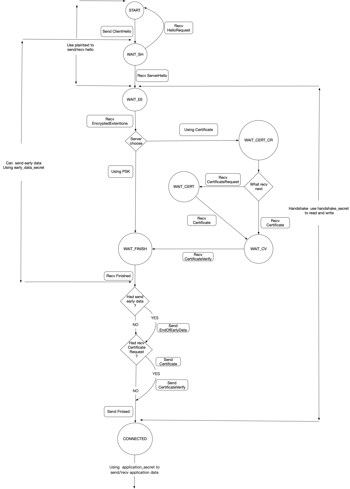

# edutls
implementation of rfc8446 TLS 1.3 in pure python (educational purpose)

# design

- as is mainly for education of TLS 1.3 standard published in 2018, it uses almost all of the concepts and key words for naming.every single message is an object which is responsible for serialization/deserialization.


- it implements the protocol process as state machine noted in rfc8446 Appendix A.1(client side).**no server side support yet.**


files layout:

```
edutls/
	|
	|
	alert.py  		--alert message serialize/deserialize
	extension.py	--extensions used in handshake message serialize/deserialize
	handshake.py	--handshake message serialize/deserialize
	record.py		--record protocol. all messages should be encoded in it to transmit
	keys.py			--key derivation implementations
	types.py		--fundamental objects for serialization/deserialization
	tls13.py		--tls1.3 protocol process implemeted as state machine
tests.py	--a simple test for tls1.3 client
```

## client state machine



# test

TLS 1.3 test servers: [tls13-spec test server](https://github.com/tlswg/tls13-spec/wiki/Implementations)

run test: `python -m unittest tests.TLSClientTest.test_client`

# limits

###### Implementations

- Client ✓
- Server x

###### Cipher Suites

- TLS_AES_128_GCM_SHA256 ✓
- TLS_AES_256_GCM_SHA384 ✓
- TLS_CHACHA20_POLY1305_SHA256 ✓
- TLS_AES_128_CCM_SHA256 ✓
- TLS_AES_128_CCM_8_SHA256 ✓

###### Supported Groups Extension

- secp256r1 ✓
- secp384r1 ✓
- secp521r1 ✓
- x25519 ✓
- x448 ✓
- ffdhe2048 ✓
- ffdhe3072 ✓
- ffdhe4096 ✓
- ffdhe6144 ✓
- ffdhe8192 ✓

###### Key Exchange Modes

- (EC)HDE ✓
- PSK-only ✓
- PSK with (EC)DHE ✓

###### Others

- session resumption ✓
- early data ✓
- cookie x
- oid filters x
- post handshake authentication x
- client certificate authentication x
- server certificate verify  x

# Note

if found any bugs, open an issue as you wish.

welcome to contribute to this educational TLS 1.3 python lib.